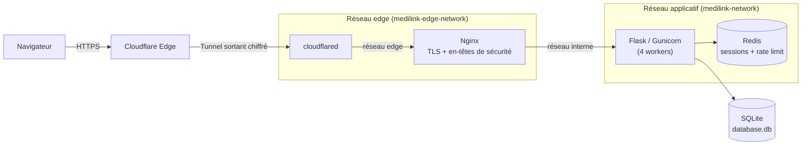
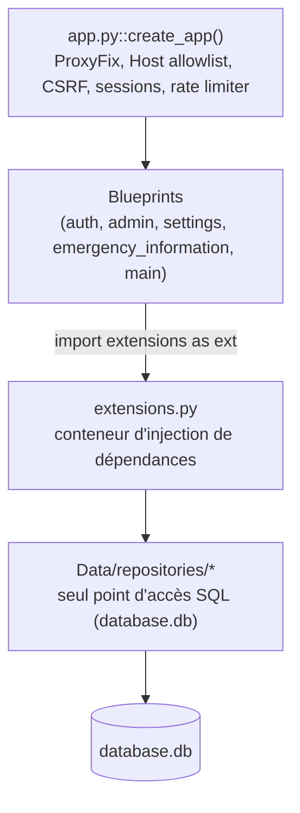

# MediLink

[](https://github.com/titou4n/MediLink/actions/workflows/docker-deploy.yml)
[](LICENSE)

Plateforme web modulaire construite avec **Flask** et **Docker Compose**, regroupant plusieurs services indépendants (authentification, administration/RBAC, paramètres utilisateur, informations d'urgence) derrière une seule application.

**Instance en production :** [https://medilink.ltjs.net](https://medilink.ltjs.net)

---

## Sommaire

- [Présentation](#présentation)
- [Fonctionnalités principales](#fonctionnalités-principales)
- [Architecture générale](#architecture-générale)
- [Stack technique](#stack-technique)
- [Structure des dossiers](#structure-des-dossiers)
- [Prérequis](#prérequis)
- [Installation](#installation)
- [Configuration](#configuration)
- [Variables d'environnement](#variables-denvironnement)
- [Lancement en développement](#lancement-en-développement)
- [Lancement avec Docker](#lancement-avec-docker)
- [Lancement en production](#lancement-en-production)
- [Commandes utiles](#commandes-utiles)
- [Tests](#tests)
- [Formatage / Lint](#formatage--lint)
- [Base de données](#base-de-données)
- [Authentification](#authentification)
- [Routes applicatives](#routes-applicatives)
- [Sécurité](#sécurité)
- [CI/CD](#cicd)
- [Contribution](#contribution)
- [Licence](#licence)
- [FAQ](#faq)

---

## Présentation

MediLink est une application web monolithique organisée en **blueprints Flask indépendants**, chacun portant une fonctionnalité métier complète (routes, logique, parfois ses propres permissions). Les données persistent dans **SQLite**, les sessions et le rate-limiting s'appuient sur **Redis**, et la mise en production passe par **Nginx** (TLS + en-têtes de sécurité) exposé au monde uniquement via un **tunnel Cloudflare** (`cloudflared`) — aucun port n'est ouvert directement sur l'hôte.

Le projet ne dispose pas de suite de tests automatisés à ce jour ; la qualité est surveillée via une série d'audits de sécurité versionnés localement dans [`audits/`](audits/) (dossier exclu de Git, voir [Sécurité](#sécurité)).

MediLink est né d'une réduction de périmètre d'un projet précédent (TitouService, qui regroupait en plus une banque simulée, un réseau social, un forum et un moteur de recherche de films) : ces modules ont été retirés du code, et seuls les blueprints ci-dessous subsistent.

## Fonctionnalités principales

| Module | Préfixe d'URL | Fonctionnalités |
|---|---|---|
| **Authentification** (`auth`) | `/` | Inscription, connexion, déconnexion, accès visiteur en un clic, 2FA par e-mail (code à 6 chiffres, haché, expiration 15 min, 3 tentatives max). Le mot de passe oublié envoie un **nouveau mot de passe généré aléatoirement** par e-mail (pas de lien de réinitialisation à jeton) |
| **Administration** (`admin`) | `/admin_panel` | Gestion des rôles et permissions, attribution de rôles (seul un Super Admin peut attribuer les rôles `admin`/`super_admin`, impossible de modifier son propre rôle) |
| **Paramètres** (`settings`) | `/settings` | Modification du profil (e-mail, pseudo, nom, mot de passe, photo de profil re-encodée par Pillow), export de compte (fichier texte), suppression de compte, gestion des sessions actives (liste, révocation individuelle, révocation globale), activation 2FA, préférences de notifications (pages présentes mais non implémentées, voir [Limitations connues](#limitations-connues)) |
| **Informations d'urgence** (`emergency_information`) | `/emergency_information` | Fiche médicale/contacts d'urgence, lien public à jeton haute entropie (`/emergency_information/public/<token>`, 96 caractères hexadécimaux), panneau d'administration dédié paginé |
| **Accueil / système** (`main`) | `/` | Page d'accueil, page d'accueil connectée, `/health` (sonde JSON de disponibilité), conditions d'utilisation |

Chaque route sensible est protégée par les décorateurs `@login_required` et `@require_permission("...")` définis dans `utils/decorators.py` (un troisième décorateur, `@require_admin`, n'est utilisé que par `emergency_information`), qui s'appuient sur le modèle de permissions décrit ci-dessous.

## Architecture générale

### Flux de requête (production)



Aucun port n'est publié sur l'hôte : `cloudflared` est le seul point d'entrée public, relié à Nginx via un réseau Docker dédié (`medilink-edge-network`). Nginx est le seul conteneur à cheval sur les deux réseaux, faisant office de passerelle vers le réseau applicatif (`medilink-network`) où vivent Flask et Redis — un `cloudflared` compromis ne peut donc pas atteindre Flask ou Redis directement.

### Composition applicative Flask



`extensions.py` est la racine de composition : il instancie une unique `DatabaseConnection` (pour `database.db`), un `DatabaseManager`, un repository par domaine, et les managers/services partagés (`session_manager`, `permission_manager`, `email_manager`, `hash_manager`, `twofa_manager`). Les blueprints et utilitaires importent `extensions` plutôt que d'instancier leurs propres dépendances.

## Stack technique

| Catégorie | Technologie |
|---|---|
| Langage | Python 3.12 |
| Framework web | Flask (`>=3.1.3` dans `flask/requirements.txt` — borne non figée, voir [Limitations connues](#limitations-connues)) |
| Serveur d'application | Gunicorn `23.0.0` (4 workers sync) |
| Base de données | SQLite (`database.db`) |
| Sessions & rate limiting | Redis `6.2.0` (Flask-Session `0.8.0`, Flask-Limiter `3.5.0`) |
| Authentification | Flask-Login `0.6.3`, 2FA maison par e-mail |
| Formulaires / CSRF | Flask-WTF `1.2.2` |
| Reverse proxy | Nginx (`nginx:latest`) — TLS, en-têtes de sécurité |
| Ingress public | Cloudflare Tunnel (`cloudflared`) — aucun port exposé sur l'hôte |
| Frontend | Jinja2 (rendu serveur), CSS et JavaScript vanilla (aucun framework, aucun `package.json`) |
| Traitement d'image | Pillow (`>=12.3.0` dans `flask/requirements.txt` — borne non figée) |
| Conteneurisation | Docker, Docker Compose |
| CI/CD | GitHub Actions (validation Nginx + build & push d'images Docker Hub — **aucun audit de dépendances automatisé actuellement**, voir [CI/CD](#cicd)) |
| Licence | Apache License 2.0 |

## Structure des dossiers

```
/
├── .github/workflows/docker-deploy.yml   # CI : validation Nginx + build/push Docker Hub
├── audits/                               # Rapports d'audit sécurité (non versionnés, .gitignore)
├── certs/                                # Certificats TLS montés dans Nginx (*.pem non versionnés)
├── docker-compose.yml                    # Orchestration : cloudflared, flask, redis, nginx
├── Makefile                              # Raccourcis docker-compose
├── nginx/
│   └── default.conf                      # Config Nginx réellement utilisée (montée en volume sur l'image officielle nginx:latest)
├── secrets/                               # Secrets Docker (non versionnés)
└── flask/
    ├── app.py                            # Fabrique d'application (create_app)
    ├── config.py                         # Configuration centralisée (env vars + secrets Docker)
    ├── extensions.py                     # Singletons / conteneur d'injection de dépendances
    ├── permissions.py                    # Taxonomie des rôles et permissions
    ├── init_db.py                        # Initialisation schéma + seeders
    ├── entrypoint.sh                     # Point d'entrée conteneur (init_db puis gunicorn)
    ├── requirements.txt
    ├── app_setup/                        # Enregistrement des blueprints, context processors
    ├── blueprints/                       # Un package par fonctionnalité (voir tableau ci-dessus)
    ├── Data/
    │   ├── connection.py                 # Wrapper sqlite3 partagé (pragmas, WAL) pour database.db
    │   ├── database_manager.py           # Création de schéma + orchestration des seeders (database.db)
    │   ├── schema/                       # DDL idempotente par domaine (database.db)
    │   ├── repositories/                 # Seule couche autorisée à écrire du SQL sur database.db
    │   └── seeders/                      # Rôles/permissions + comptes (super admin, visiteur, debug)
    ├── models/                           # Modèles applicatifs (User, EmergencyInformation)
    ├── utils/                            # Managers (session, e-mail, 2FA...) et décorateurs
    ├── templates/                        # Templates Jinja2, un dossier par blueprint
    └── static/                           # css/, js/, img/, icon/, uploads/
```

## Prérequis

| Outil | Version minimale | Requis pour |
|---|---|---|
| Docker | 20.10+ | Exécution conteneurisée (dev ou prod) |
| Docker Compose | 2.0+ | Orchestration des services |
| Python | 3.12 | Développement local sans Docker |
| Redis | 6.0+ | Sessions et rate-limiting, **obligatoire même en développement** — `create_app()` échoue si Redis est injoignable |

## Installation

```bash
git clone https://github.com/titou4n/MediLink.git
cd MediLink
```

## Configuration

La configuration est centralisée dans [`flask/config.py`](flask/config.py) (classe `Config`). Le comportement dépend de `ENV_PROD` :

- **`ENV_PROD=false`** (développement) : les secrets et variables sont lus depuis `flask/.env` via `python-dotenv`.
- **`ENV_PROD=true`** (production) : les secrets sont lus depuis des fichiers montés en lecture seule sous `/run/secrets/<nom>` (Docker Secrets) ; les autres variables restent lues depuis l'environnement du conteneur (définies dans `docker-compose.yml`).

Deux secrets sont **obligatoires** dans les deux modes — `create_app()` lève une `RuntimeError` au démarrage si l'un d'eux manque : `SECRET_KEY`, `EMAIL_APP_PASSWORD`.

Un modèle versionné est fourni : copiez [`flask/.env.example`](flask/.env.example) vers `flask/.env` puis remplacez les valeurs `changeme` par de vraies valeurs (le tableau des variables ci-dessous reste la référence complète, y compris certaines variables absentes du modèle).

```bash
cp flask/.env.example flask/.env
```

## Variables d'environnement

### Secrets (obligatoires)

| Variable | Fichier Docker Secret (prod) | Description |
|---|---|---|
| `SECRET_KEY` | `secret_key.txt` | Clé de signature des sessions Flask |
| `EMAIL_APP_PASSWORD` | `email_app_password.txt` | Mot de passe applicatif Gmail (envoi des e-mails/2FA) |
| `cloudflare_tunnel_token` | `cloudflare_tunnel_token.txt` | Jeton du tunnel Cloudflare (prod uniquement, service `cloudflared`) |

### Application

| Variable | Défaut | Rôle |
|---|---|---|
| `ENV_PROD` | `false` | Bascule dev/prod (source des secrets, cookies sécurisés, debug) |
| `USERNAME_SUPER_ADMIN` | `superadmin` | Nom d'utilisateur du compte super admin bootstrapé |
| `EMAIL_ADDRESS` | `medilink.mail@gmail.com` | Adresse d'expédition des e-mails (2FA, notifications) |
| `CREATE_SEEDED_ACCOUNTS` | `false` | Définie et documentée, mais **non lue par le code actuel** (`Data/seeders/accounts_seeder.py` seede le compte visiteur inconditionnellement, et le compte debug uniquement si `ENV_PROD=false`, sans consulter ce flag) |
| `USERNAME_VISITOR` / `PASSWORD_VISITOR` | `UsernameVisitor` / `PasswordVisitor` | Identifiants du compte visiteur de démonstration |
| `USERNAME_DEBUG` / `PASSWORD_DEBUG` | `username_debug` / `password_debug` | Identifiants du compte de debug (seedé uniquement si `ENV_PROD=false`, rôle `super_admin`) |
| `NEED_TO_RESET_ALL_DB` | `false` | Réinitialise entièrement la base `database.db` au démarrage |
| `NEED_TO_RESET_DB_EXCEPT_ACCOUNT` | `false` | Censée réinitialiser tout sauf les comptes ; la liste de tables protégées dans le code (`accounts`, `account_preferences`) ne correspond pas aux noms de tables réels (`account`, `user_preferences`) — voir [Limitations connues](#limitations-connues) |
| `NEED_TO_RESET_ROLES_PERMISSIONS_TABLES` | `false` | Réinitialise uniquement rôles/permissions |
| `MAX_UPLOAD_SIZE_MB` | `16` | Taille maximale (Mo) de toute requête entrante (`MAX_CONTENT_LENGTH` Flask). La photo de profil a en plus une limite dédiée de 5 Mo, codée en dur dans `settings/services.py` (non exposée en variable d'environnement) |
| `SESSION_COOKIE_TIME_DAYS` / `_HOURS` / `_MINUTES` | `0` / `1` / `0` | Durée de vie de l'enregistrement de session côté Redis (table `sessions`) — distincte du `SESSION_COOKIE_MAX_AGE` du cookie lui-même (1h, codé en dur) |
| `TWOFA_TIMELAPS_MINUTES` | `15` | Durée de validité d'un code 2FA |
| `MIN_PASSWORD_LENGTH` | `10` | Longueur minimale imposée côté serveur à l'inscription et au changement de mot de passe (aucune règle de complexité au-delà de la longueur) |
| `EMERGENCY_INFO_ADMIN_PAGE_SIZE` | `25` | Taille de page du panneau d'administration `emergency_information` |
| `EXTERNAL_URL_BASE` | `https://medilink.ltjs.net` | Base des URL générées (liens de jeton, etc.), jamais dérivée de `request.host` — doit correspondre à une entrée d'`ALLOWED_HOSTS` |

### Réseau / proxy

| Variable | Défaut | Rôle |
|---|---|---|
| `RATELIMIT_STORAGE_URI` | `redis://localhost:6379/0` | URL Redis (sessions + rate limiting) |
| `PROXY_TRUSTED_HOP_COUNT` | `2` | Nombre de sauts proxy de confiance, passé à `ProxyFix`. Topologie réelle : Cloudflare ajoute l'IP visiteur, puis Nginx ajoute son propre pair (`cloudflared`) avant Flask, d'où `2`. Valeur cohérente entre le défaut Python de `config.py`, `.env.example` et l'override explicite de `docker-compose.yml` en production |

> `ALLOWED_HOSTS` (`medilink.ltjs.net`, `localhost`, `127.0.0.1`, `[::1]`) est codé en dur dans `config.py` — toute nouvelle valeur de domaine doit y être ajoutée.

## Lancement en développement

```bash
cd flask
pip install -r requirements.txt
python app.py
```

- Nécessite un Redis joignable localement (par défaut `redis://localhost:6379/0`) et un fichier `flask/.env` avec `ENV_PROD=false` + les deux secrets obligatoires en variables d'environnement.
- L'application démarre sur `http://127.0.0.1:8080`.
- Au premier lancement, si `flask/Data/db/database.db` n'existe pas encore, l'initialisation (schéma + seeders) est exécutée automatiquement avant de servir des requêtes.

## Lancement avec Docker

```bash
docker-compose up --build
```

Ce mode démarre les quatre services (`cloudflared`, `flask`, `redis`, `nginx`). En local sans tunnel Cloudflare configuré, le conteneur `cloudflared` échouera à s'authentifier — pour un test purement local, commentez ce service ou publiez temporairement le port de `nginx` dans `docker-compose.yml`.

## Lancement en production

1. Créer le dossier `secrets/` à la racine avec les fichiers suivants :

   ```bash
   mkdir -p secrets
   python3 -c "import secrets; print(secrets.token_hex(32))" > secrets/secret_key.txt
   echo "<mot de passe app Gmail>" > secrets/email_app_password.txt
   echo "<jeton du tunnel Cloudflare>" > secrets/cloudflare_tunnel_token.txt
   ```

2. Générer/monter les certificats TLS utilisés par Nginx dans `certs/` (voir [`certs/SSL_SETUP.md`](certs/SSL_SETUP.md) — Cloudflare Origin Certificate, Let's Encrypt ou certificat auto-signé).

3. Démarrer la stack :

   ```bash
   make build
   make up
   ```

Le seul chemin d'entrée public est le tunnel Cloudflare (`cloudflared`) : aucun port n'est publié sur l'hôte (`ports:` absent des services `nginx` et `flask` dans `docker-compose.yml`).

## Commandes utiles

| Commande | Effet |
|---|---|
| `make build` | `docker-compose build --no-cache` |
| `make up` | `docker-compose up -d` |
| `make down` | `docker-compose down` |
| `make restart` | `docker-compose restart` |
| `make logs` | `docker-compose logs -f` |
| `make clean` | `docker-compose down -v && docker system prune -f` |
| `python flask/init_db.py` | (Ré)crée le schéma `database.db` et exécute les seeders (idempotent) |
| `rm flask/Data/db/database.db` | Supprime la base de dev (à relancer avec `init_db.py`) |

Un aide-mémoire de commandes Docker plus étendu (gestion des conteneurs, logs, accès aux conteneurs, volumes) est disponible dans [`rappel_docker_commands.txt`](rappel_docker_commands.txt) à la racine du dépôt.

## Tests

Il n'existe **aucune suite de tests automatisés** dans ce dépôt (pas de dossier `tests/`, pas de configuration `pytest`/`unittest`, aucune étape de test dans la CI). La vérification de non-régression repose actuellement sur des revues manuelles documentées dans [`audits/`](audits/) (dossier local, non versionné).

## Formatage / Lint

Aucun outil de lint ou de formatage n'est configuré (pas de `.flake8`, `pyproject.toml`, `ruff.toml`, `.pre-commit-config.yaml`, ni d'équivalent JS). Respectez le style existant du fichier modifié à défaut de règle automatisée.

## Base de données

Une seule base SQLite :

| Fichier | Domaine | Gestion | Tables |
|---|---|---|---|
| `database.db` | Application principale | `Data/connection.py` (pragmas `foreign_keys`, WAL, `synchronous`), schéma géré par `Data/database_manager.py` | `account`, `user_preferences`, `metadata` (comptes/connexions) · `sessions`, `two_factor_codes` (auth) · `roles`, `permissions`, `role_permissions` (RBAC) · `emergency_information` |

L'initialisation de `database.db` (`python flask/init_db.py`, ou automatiquement au premier démarrage du conteneur via `entrypoint.sh`) crée le schéma (DDL idempotente `CREATE TABLE IF NOT EXISTS`) puis exécute le seeder de rôles/permissions :

- **Rôles & permissions** — 5 rôles (`super_admin`, `admin`, `moderator`, `user`, `visitor`), seedés par `RolesPermissionsSeeder`.
- **Comptes** — le seeder de comptes (`AccountsSeeder`) bootstrap le compte Super Admin avec un mot de passe aléatoire (`secrets.token_urlsafe(24)`), affiché **une seule fois** dans les logs, jamais persisté en clair ; ce compte est verrouillé sur la page de changement de mot de passe tant qu'il ne l'a pas modifié. Il seede aussi un compte visiteur (toujours) et un compte de debug (uniquement si `ENV_PROD=false`) — ce seeder n'est actuellement invoqué **que** par le point d'entrée `python app.py` en développement (`if __name__ == '__main__'`), pas depuis `entrypoint.sh`/`init_db.py`.

Réinitialisation contrôlée par les variables `NEED_TO_RESET_ALL_DB`, `NEED_TO_RESET_DB_EXCEPT_ACCOUNT`, `NEED_TO_RESET_ROLES_PERMISSIONS_TABLES` (voir [Variables d'environnement](#variables-denvironnement)) — désactivées par défaut, y compris en production.

Certains champs de la table `account` (`pay`, une colonne de solde numérique) sont des reliquats du périmètre TitouService retiré : ils restent dans le schéma (toujours utilisés par l'export de données de `settings`) mais ne sont alimentés par aucune fonctionnalité active — les comptes démarrent et restent à `0.0`.

## Authentification

- **Connexion / inscription** : Flask-Login, mots de passe hachés avec `werkzeug.security` (PBKDF2-SHA256). Pas de mécanisme de verrouillage de compte après échecs répétés — la seule protection anti brute-force est le rate-limiting par IP (`5/min ; 20/heure ; 100/jour` sur `/login`).
- **Mot de passe oublié** : génère et envoie par e-mail un **nouveau mot de passe aléatoire** (`secrets.token_urlsafe`, 20 caractères) — il ne s'agit pas d'un lien de réinitialisation à jeton.
- **2FA par e-mail** : code numérique à 6 chiffres, haché, valide 15 minutes (`TWOFA_TIMELAPS_MINUTES`), limité à 3 tentatives ; activable par utilisateur depuis `/settings/security`.
- **Sessions** : stockées dans Redis (Flask-Session), cookie `session_id` (`HttpOnly`, `SameSite=Strict`, `Secure` en production, durée de vie 1 heure fixe). L'enregistrement de session en base (table `sessions`, utilisée pour la liste des sessions actives et leur révocation depuis `/settings/security`) a une expiration configurable séparément via `SESSION_COOKIE_TIME_DAYS`/`_HOURS`/`_MINUTES` (1 heure par défaut).
- **RBAC** : 5 rôles (`super_admin`, `admin`, `moderator`, `user`, `visitor`) et permissions nommées définies dans [`flask/permissions.py`](flask/permissions.py), appliquées via les décorateurs `@login_required` / `@require_permission("...")` (`flask/utils/decorators.py`). `admin` et `super_admin` ont un jeu de permissions **identique** dans `permissions.py` ; ils ne sont distingués que par des comparaisons de `role_name` codées en dur dans certaines routes (ex. `admin/routes.py::assign_role`) et par `enforce_password_change` dans `app.py`.
- **CSRF** : Flask-WTF (`CSRFProtect`) actif sur toute l'application — protège par défaut les méthodes non sûres (POST/PUT/PATCH/DELETE) uniquement, jamais les GET.
- **Rate limiting** : Flask-Limiter (Redis), identification du client via `extensions.py::get_client_identifier()`, qui renvoie directement `request.remote_addr` tel que déjà résolu par `ProxyFix` (`PROXY_TRUSTED_HOP_COUNT` sauts de confiance appliqués au niveau WSGI, avant tout code applicatif) — aucune re-lecture ou vérification CIDR d'en-tête proxy n'a lieu dans cette fonction.

## Routes applicatives

Aucune API REST/JSON dédiée. Le seul endpoint qui renvoie du JSON est :

| Endpoint | Méthode | Rôle |
|---|---|---|
| `/health` | GET | Sonde de disponibilité (Redis, `database.db`), consommée par le `HEALTHCHECK` Docker |

## Sécurité

- **En-têtes Nginx** : HSTS (2 ans, `preload`), CSP stricte sans `unsafe-inline`, `X-Frame-Options: DENY`, `X-Content-Type-Options: nosniff`, `Referrer-Policy`, `Permissions-Policy`, en-têtes COEP/COOP/CORP.
- **Validation du Host header** applicative (`app.py::validate_host`) contre `ALLOWED_HOSTS`, en complément du rejet Nginx (`return 444`) sur un `server_name` non reconnu.
- **Résolution de l'IP client** exclusivement via `ProxyFix` au niveau WSGI (voir [Authentification](#authentification)) — pas de vérification CIDR applicative, celle-ci ayant été retirée du code comme devenue redondante avec `ProxyFix`.
- **Secrets** jamais versionnés (`secrets/`, `flask/.env`, `flask/prod.env`, `audits/*.md` exclus par `.gitignore`) ; secrets Docker montés en lecture seule.
- **Historique d'audit** : `audits/` contient une série chronologique de revues de sécurité manuelles, non versionnées dans Git (`audits/*.md` dans `.gitignore` ; seul `audits/security_audit.txt`, le prompt réutilisable qui sert à en générer une nouvelle, est suivi). Consultez le fichier `audits/audit_*.md` le plus récent (trier par date, pas par nom) avant toute modification de `config.py`, de la validation du Host header, de la configuration des sessions/cookies, ou de `flask/Dockerfile`. Voir aussi [CLAUDE.md](CLAUDE.md#sécurité--historique-daudit) pour l'historique détaillé.

  Point ouvert de longue date, inchangé : hachage PBKDF2-SHA256 plutôt qu'un KDF mémoire-dur (Argon2id).

### Cloudflare (WAF / rate limiting côté edge)

Le tunnel Cloudflare (`cloudflared`) est le seul point d'entrée public (voir [Architecture générale](#architecture-générale)), mais sa configuration de sécurité — WAF managé et règles de rate-limiting Cloudflare — vit entièrement dans le **dashboard Cloudflare**, hors de ce dépôt : il n'y a aucun fichier ici qui la décrit ou la provisionne (pas de Terraform/API Cloudflare versionné à ce jour). C'est un point ouvert de longue date, non exploitable en soi (le rate-limiting applicatif Flask-Limiter + Redis reste actif indépendamment, voir [Authentification](#authentification)), mais c'est une couche de défense en profondeur absente en amont de l'application.

Recommandé (à activer manuellement dans le dashboard Cloudflare du domaine, aucune action possible depuis ce dépôt) :
- Activer le **WAF managé** (Cloudflare Managed Ruleset) sur `medilink.ltjs.net`.
- Ajouter une **règle de rate-limiting Cloudflare** ciblant `/login`, `/register`, `/forgot_password` en complément du rate-limiting applicatif, pour bloquer le trafic abusif avant même qu'il n'atteigne `cloudflared`.

Si cette configuration est un jour exportée/versionnée (ex. via Terraform), documenter ici son emplacement et retirer cette note.

## CI/CD

[`.github/workflows/docker-deploy.yml`](.github/workflows/docker-deploy.yml) se déclenche à chaque push sur `main` :

1. Validation de la syntaxe Nginx (`nginx -t` dans un conteneur isolé, avec certificat de test) contre `nginx/default.conf` — la configuration réellement utilisée en production (montée en volume sur l'image officielle `nginx:latest`).
2. Connexion à Docker Hub.
3. Build et push de `titou4n/medilink-flask` (tag `latest` + SHA du commit).

Aucune étape de test applicatif ni d'audit de dépendances (`pip-audit`) n'est présente dans ce workflow — une étape `pip-audit` existait auparavant mais a été retirée (voir [Sécurité](#sécurité)). Il n'existe pas de `nginx/Dockerfile` ni d'image `titou4n/medilink-nginx` : un Dockerfile Nginx custom cassé et son étape CI ont été supprimés, puisque `docker-compose.yml` n'en avait jamais eu besoin.

## Contribution

Aucune convention de contribution formelle (pas de `CONTRIBUTING.md`, pas de template de PR/issue) n'est définie à ce jour. Pratiques observées dans l'historique Git :

- Développement sur des branches de fonctionnalité nommées par domaine, fusionnées vers `main` via Pull Request.
- Messages de commit courts et impératifs, en français ou en anglais selon le contexte.
- Dependabot est actif sur les dépendances Python (`flask/requirements.txt`).

## Licence

[Apache License 2.0](LICENSE).

## FAQ

**Pourquoi l'application refuse-t-elle de démarrer en local avec une erreur Redis ?**
Redis est une dépendance dure, y compris en développement : `create_app()` tente une connexion (`redis_client.ping()`) et lève une `RuntimeError` si elle échoue. Démarrez un Redis local (`docker run -p 6379:6379 redis:7-alpine` par exemple) avant `python app.py`.

**Pourquoi `docker-compose up` échoue-t-il sur le service `cloudflared` en local ?**
Ce service nécessite un jeton de tunnel Cloudflare valide (`secrets/cloudflare_tunnel_token.txt`) et une configuration de tunnel côté Cloudflare. Pour un test Docker purement local, commentez ce service ou exposez temporairement un port sur `nginx`.

**Pourquoi le conteneur Flask tourne-t-il en `root` alors que la sécurité recommande un utilisateur non privilégié ?**
Décision assumée temporairement : un précédent passage en non-root (`useradd appuser` + `USER appuser`) a cassé le démarrage en production à cause de la propriété du volume nommé `db-data`, déjà peuplé par des runs antérieurs en root (les fichiers existants d'un volume ne sont pas automatiquement re-chownés lors d'un changement d'utilisateur). Voir [CLAUDE.md](CLAUDE.md#à-éviter--pièges-connus) pour la procédure de correction recommandée avant de retenter le passage en non-root.
